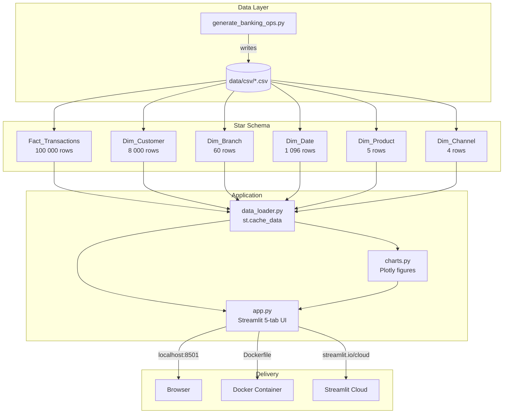

# BankLens — Banking Operations Analytics Platform

A portfolio-grade analytics platform built with Python, Streamlit, and Plotly.
It processes 100 000 synthetic banking transactions across a star-schema dataset
and surfaces operational insights across five interactive dashboard tabs.

[](https://github.com/mashraf-portfolio/banklens/actions/workflows/ci.yml)

---

## Live Demo

> Deploy to [Streamlit Community Cloud](https://streamlit.io/cloud) — point it at `src/app.py`.

---

## Architecture



---

## Dashboard Tabs

| Tab | Key Charts & Metrics |
|-----|----------------------|
| **Executive Summary** | KPI cards, monthly volume (dual-axis), revenue by product, segment donut |
| **Transaction Trends** | Stacked-area by type, avg value by channel, day-of-week heatmap |
| **Customer Segmentation** | CLV box-plot, avg balance by segment, tenure histogram, age-group bar |
| **Branch Performance** | Efficiency score bar, region revenue, headcount vs revenue scatter |
| **Digital vs Physical** | Adoption-rate trend, stacked-area channel split, avg value comparison |

---

## Metrics (DAX equivalents in Python)

| Metric | Formula |
|--------|---------|
| Transaction Volume | `COUNT(transaction_id)` |
| Avg Transaction Value by Channel | `MEAN(amount) GROUP BY channel` |
| Digital Adoption Rate | `SUM(is_digital) / COUNT(*)` |
| CLV Proxy | `avg_balance × tenure_months × 0.02` |
| Branch Efficiency Score | `total_revenue / headcount` |
| Revenue by Product Line | `SUM(amount × revenue_rate) GROUP BY product_line` |

---

## Star Schema

```
Dim_Date ──┐
Dim_Customer ──┤
Dim_Branch ────┼── Fact_Transactions (100 K rows)
Dim_Product ───┤
Dim_Channel ───┘
```

---

## Quick Start

```bash
# 1. clone
git clone https://github.com/mashraf-portfolio/banklens.git
cd banklens

# 2. install deps
pip install -r requirements.txt

# 3. generate dataset
python data/generate_banking_ops.py

# 4. run app
streamlit run src/app.py
```

### Docker

```bash
docker build -t banklens .
docker run -p 8501:8501 banklens
# open http://localhost:8501
```

---

## Project Structure

```
banklens/
├── data/
│   ├── generate_banking_ops.py   # synthetic data generator
│   └── csv/                      # generated CSVs (git-ignored)
├── src/
│   ├── app.py                    # Streamlit entry point
│   ├── data_loader.py            # cached data loading & aggregations
│   └── charts.py                 # Plotly figure factories
├── tests/
│   └── test_metrics.py           # pytest suite (7 test classes, 25+ assertions)
├── .github/
│   └── workflows/
│       └── ci.yml                # ruff lint → pytest → docker build
├── Dockerfile
├── requirements.txt
└── README.md
```

---

## CI Pipeline

```
push / PR → lint (ruff) → test (pytest) → docker build
```

All jobs run on `ubuntu-latest` with Python 3.12.

---

## Tech Stack

| Layer | Technology |
|-------|------------|
| Data generation | Python · NumPy · Pandas |
| Visualisation | Plotly |
| UI | Streamlit |
| Containerisation | Docker |
| CI/CD | GitHub Actions |
| Linting | Ruff |
| Testing | Pytest |
